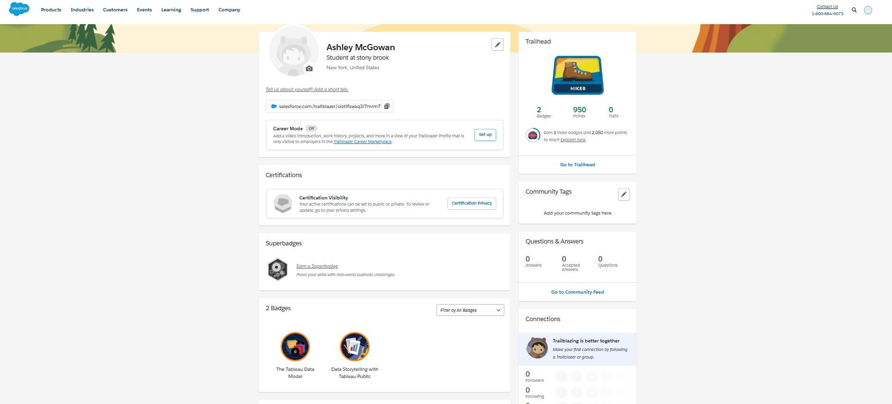
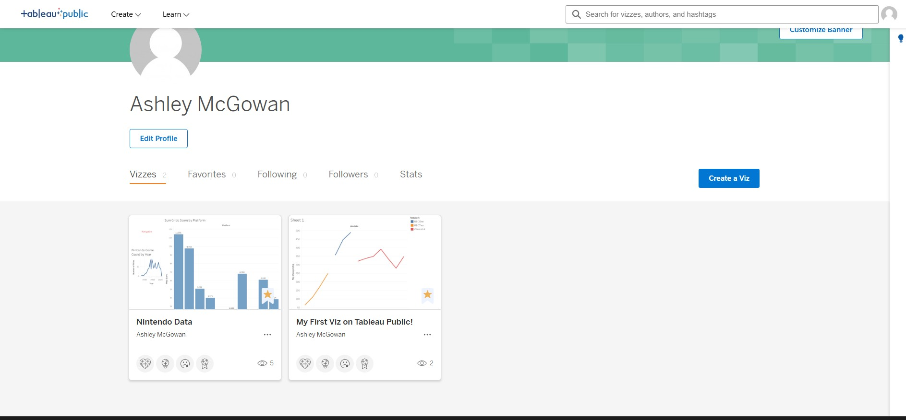
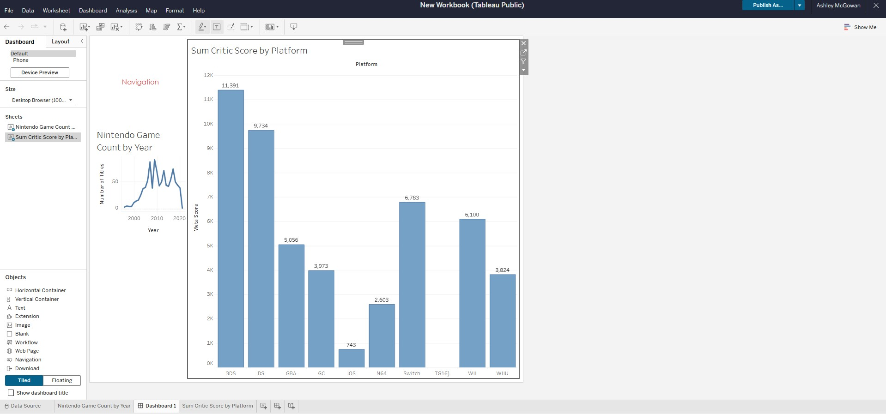

# Tableau_trailhead_basics

## Badges

## Vizzes
### [Link to Profie](https://public.tableau.com/app/profile/ashley.mcgowan5903/vizzes)

---

# Reflection

One idea from the Data Storytelling with Tableau Public module that stood out to me was the importance of keeping a straightforward narrative, which guided the design of my final visualization. From the Tableau Data Model module, I learned that Tableau uses relationships rather than traditional joins to preserve the correct level of detail when combining multiple tables. This matters in a healthcare setting, where patient data is often split across visits, labs, diagnoses, and even care teams.
